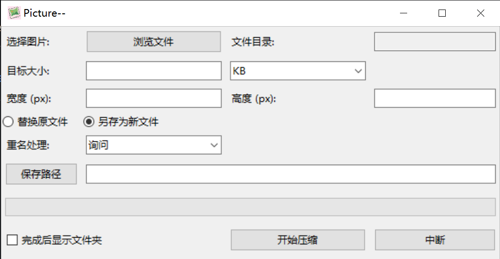

# Picture-- 
!(Description/iconic.jpg) 
一个简洁高效的图片压缩工具，提供灵活的尺寸调整和文件大小控制，支持批量处理与智能重命名。

 

## 主要功能

- 🖼️ **批量处理** - 支持选择多个图片文件进行批量压缩
- 📏 **尺寸调整** - 可自定义输出分辨率（强制保持宽高比）
- 📦 **大小控制** - 支持按B/KB/MB/GB单位设置目标文件大小
- 🔄 **灵活保存** - 可选替换原文件或另存为新文件
- ⚙️ **冲突处理** - 提供覆盖/重命名/询问三种重名处理方式
- 📁 **输出路径跳转** - 支持完成后自动打开输出目录

## 快速开始

### 安装依赖
```bash
pip install pillow
```

### 使用说明
#### 选择文件
点击"浏览文件"按钮选择需要压缩的图片

#### 设置参数
- 📏 分辨率：在宽度/高度栏输入像素值（留空保持原比例）
- 📦 目标大小：输入数字并选择单位（设为0则仅调整分辨率）
- 💾 保存模式：
  - 替换原文件：直接覆盖原始图片
  - 另存为新文件：保存到指定目录

#### 处理冲突
选择重名文件处理策略：询问/覆盖/自动重命名

#### 开始压缩
点击"开始压缩"按钮启动处理流程

#### 查看结果
处理完成后自动打开输出目录（可选功能）

## 注意事项
- ⚠️ **当设置目标大小时**：
  - 实际输出大小可能略大于目标值（精度限制）
  - 源文件小于目标大小时会自动跳过
  - 最小允许设置为1KB

- ⚠️ **分辨率调整**：
  - 需要保持原始宽高比（若强制修改比例会报错）
  - 允许的最小分辨率为10x10像素

- ⚠️ **文件保存**：
  - 选择"替换原文件"时，原始图片不可恢复
  - 建议重要文件先使用"另存为新文件"模式

## 错误处理
程序自动记录错误日志到`compression_errors.log`，遇到问题时请查看该文件获取详细错误信息。
注：实际使用时建议：
1. 添加 `screenshots` 文件夹存放界面截图
2. 在 `## 快速开始` 前补充版本号（如 `v1.0.0`）
3. 在文档底部添加版权声明和联系方式
4. 如需开源项目，可补充 `CONTRIBUTING.md` 链接
